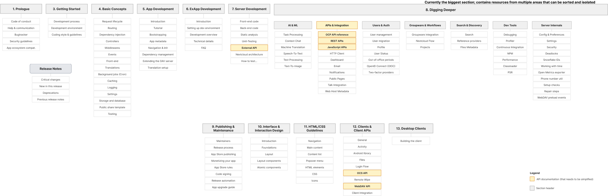
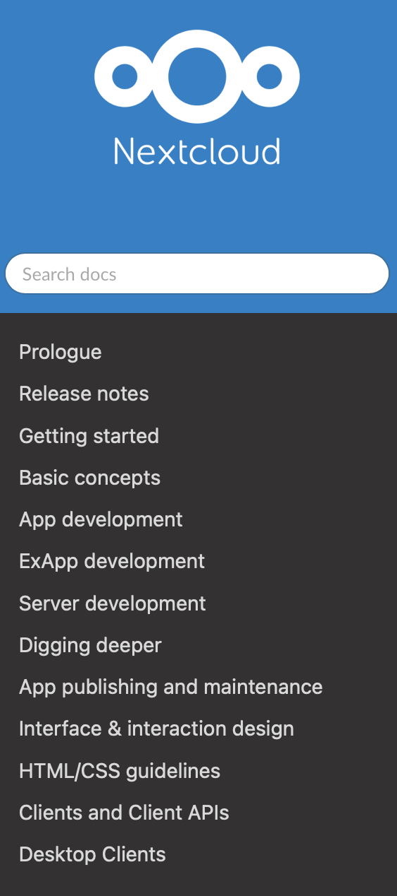
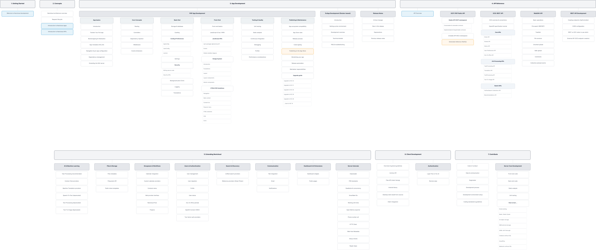
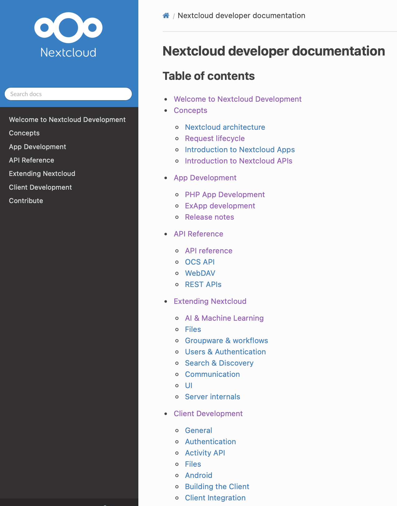
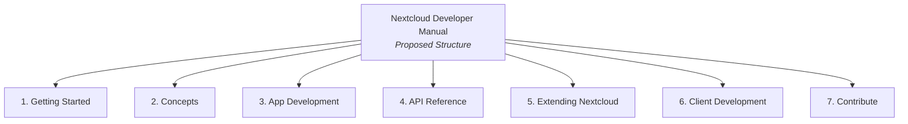
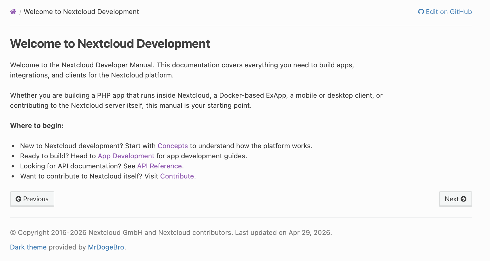
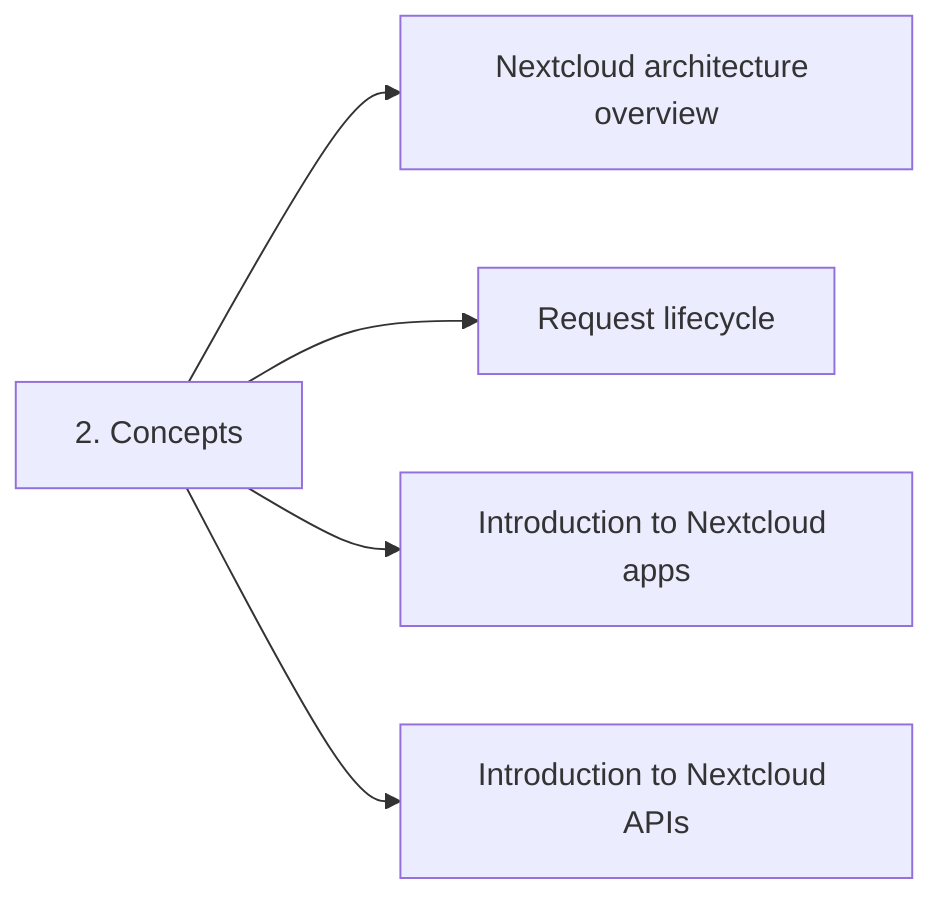
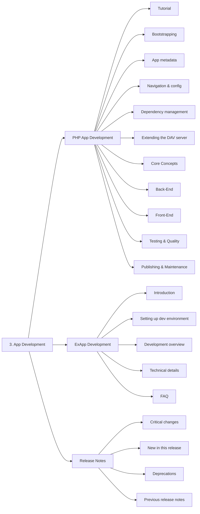
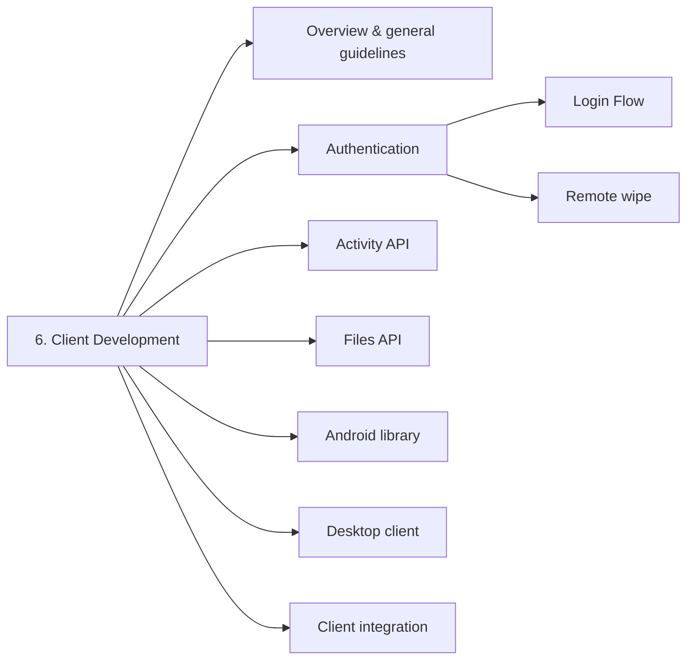
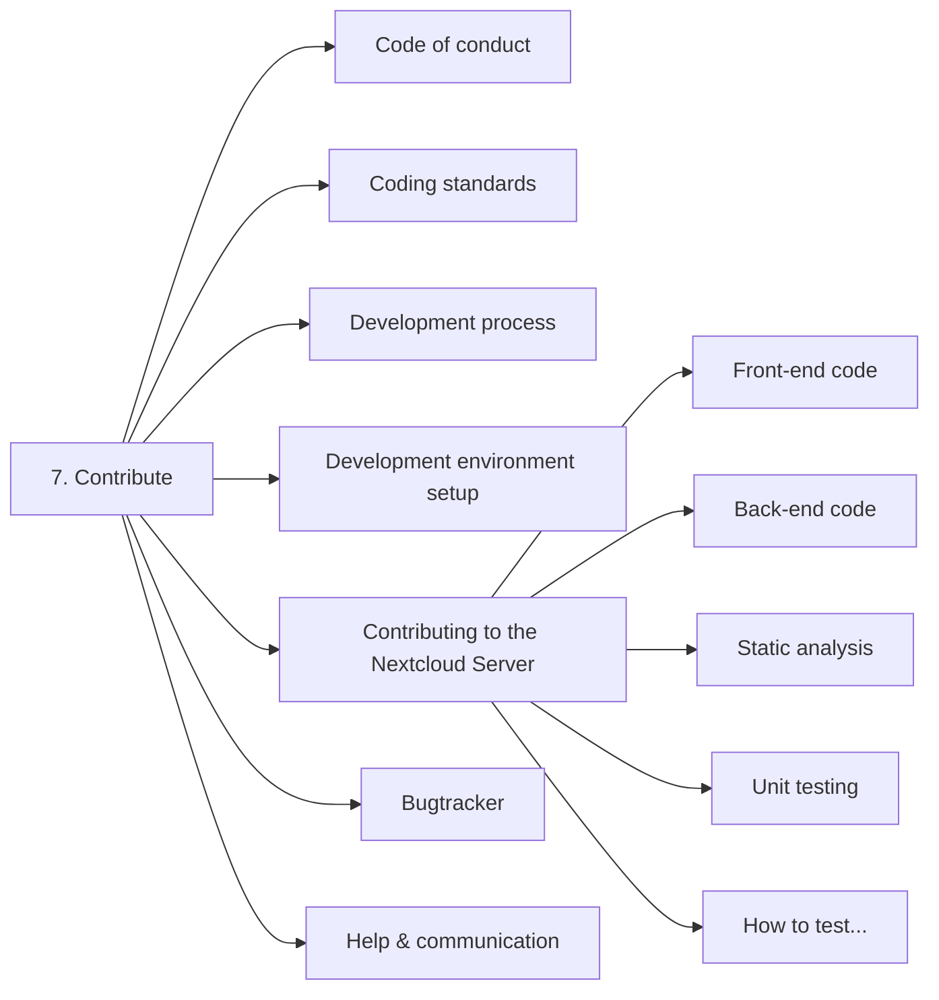

# Nextcloud documentation restructure - Approach 1

Prepared by Eeshaan Sawant for the Nextcloud Developer Relations challenge.

## Summary - Approach 1

[The Nextcloud Developer Manual](https://docs.nextcloud.com/server/latest/developer_manual/) has grown organically over time, as engineers added and updated content. While the content is rich and technically sound, the structure makes it difficult for newcomers to navigate and for experienced developers to quickly find API documentation.

This approach:

- Analyzes the current structure and identifies key problems
- Proposes a new content hierarchy which restructures the developer manual almost completely, adds multiple new pages across sections, and makes it easier for developers to discover important documentation such as App Development, API references and documentation on extending the functionality of Nextcloud.
- Pays special attention to API discoverability (OCP, OCS, and WebDAV APIs), Contributor Onboarding and Developer Experience.

## Current Structure

I tried multiple ways to map the current hierarchy of the developer manual. After trying out Mermaid, Draw.io and other tools, I imported an SVG file from Draw.io to Figma, which seemed to work the best.

Here is the current flowchart of [version 34 of the developer manual](https://docs.nextcloud.com/server/latest/developer_manual/index.html):



If the image is difficult to read, check out the [.svg file for this flowchart](./src/img/developer-manual-current.svg).

Here is what the side bar looks like from the landing page:



### Major issues with the current structure

#### 1. Digging Deeper section

The digging deeper section contains over 40 pages covering information for topics such as AI/ML providers to Phone number, out of office utilities and more.

Compared to the older versions, the latest version has a development effort which aims to separate these pages into meaningful categories, but, because information was added overtime and perhaps because the "Digging Deeper" section was treated as an "Advanced Concepts" category, some information (that is better off in other sections) has ended up in this section, resulting in scattering of information.

#### 2. API Documentation is scattered across multiple sections

Here's how the major API references are structured in the current manual:

| API | Current location |
| --- | --- |
| **OCP** (PHP Public API) | Digging Deeper → APIs & Integration → API reference |
| **OCS** (REST API) | Clients and Client APIs → OCS API |
| **WebDAV** | Clients and Client APIs → WebDAV |
| **REST API development** | Digging Deeper → APIs & Integration → REST APIs |
| **JavaScript APIs** | Digging Deeper → APIs & Integration → JavaScript APIs |
| **External API** | Server Development → External API |

This layout causes many issues — for example, a developer needing OCP API + REST API finds them in two different top-level sections, and an external integration needing OCS + WebDAV may not look in "Clients and Client APIs" because the name implies it is for clients. The most prominent issue, however, is the lack of a unified API landing page. That is why, in the proposed structure, I have introduced a dedicated landing page that explains what each Nextcloud API is and what it can do, and then directs developers organically to the required documentation.

I have also tried amalgamating most API references into the new "API reference" section (which you can see below), without losing the context.

#### 3. "ExApps" as separate top-level section creates confusion about app types

ExApps (NC apps on Docker-based framework) are an alternative to traditional PHP apps. Having them as a sibling section to "App development" can confuse readers. ExApps should be a subcategory of "App Development" instead.

## Highlights and key changes made

- **Converged 13 top-level sections into 7**, without losing any content or context.
- **Added a dedicated API Reference section** with a landing page to organically navigate developers to the required documentation
- **Digging Deeper section dissolved**. Same pages were distributed in other sections according to the content they held, and other pages were placed in the new "Extending Nextcloud" section, which can also be the "Advanced Concepts" section, perhaps something the developer originally intended.
- **PHP Apps and ExApps now have a single home**. Both have been moved to the new "App Development" section, which holds all the relevant information for developing Nextcloud apps.
- **A new "Contribute" section (personal favorite)**. Community norms, contribution processes and guidelines and the information to contributing to the NC Server, all have been moved to the "Contribute" section. (Ref. Kubernetes Documentation).
- **Prologue dissolved.** Now replaced with a 'Welcome' landing page.

## New Structure

Here is the proposed hierarchy for the developer manual:



If the image is difficult to read, check out the [.svg file for this flowchart](./src/img/developer-manual-proposed.svg).

And here is how the sidebar looks with the new structure (changes made to my fork using GitHub Codespaces):



### Walkthrough of the new sections



#### 1. Getting Started

A welcome page. Introduces the developer manual, explains who it is for (app developers, client developers, contributors), and points readers to the right section. Replaces the old "Prologue", and provides a better entry point.

Take a look at a screenshot from POC:



#### 2. Concepts

High-level understanding of how Nextcloud works. Architecture overview, request lifecycle, how apps work (PHP vs ExApp), why and what is the API Reference and more.



#### 3. App Development

The largest section, and intentionally, because most readers would eventually end up here. App dev is now split into clear paths — PHP Apps and ExApps — with a third sibling category, Release Notes, that tells app maintainers when to update their apps. This is, although, **open to discussion** and can also be put in the root dir.



**PHP App Development** covers the full lifecycle: tutorial, core concepts (routing, controllers, DI, middleware, events), back-end (storage, caching, config, security, background jobs), front-end (Vue/JS, design system, HTML/CSS — absorbing the old sections 9 and 10), testing & quality, and publishing & maintenance.

**ExApp Development** is kept separate within the same section because ExApps don't use PHP core concepts, back-end patterns, or the same front-end tooling. Mixing them would confuse both audiences.

#### 4. API Reference

All API documentation necessary for a developer to get started has been bundled under this section. OCP, OCS, WebDAV, REST API development are the 4 sub-sections.

This is what the entire section looks like:

```markdown
├── API Overview
├── OCP: PHP Public API
│   ├── Stable API (OCP namespace)
│   ├── Unstable API (NCU namespace)
│   └── External reference
├── OCS: REST API
│   ├── OCS overview & conventions
│   ├── OpenAPI specification tutorial
│   ├── Core APIs
│   │   ├── Share API
│   │   ├── Sharee API
│   │   ├── Status API
│   │   ├── User Preferences API
│   │   └── Out-of-office API
│   ├── AI & Processing APIs
│   │   ├── TaskProcessing API
│   │   ├── Translation API
│   │   ├── TextProcessing API
│   │   └── Text-To-Image API
│   └── Search APIs
│       ├── FullTextSearch Collections
│       └── Recommendations API
├── WebDAV API
│   ├── Basic operations
│   ├── File search (REPORT)
│   ├── Trashbin
│   ├── File versions
│   ├── Chunked upload
│   ├── Bulk upload
│   ├── Comments
│   └── Collection preload events
└── REST API Development
    ├── Creating endpoints (ApiController)
    ├── CORS configuration
    ├── REST vs OCS: when to use which
    └── External API (OCS endpoint creation)
```

The landing page for the "API reference" section is named "Choosing the right API" (which can also be named as "API Guide" or similar; new page) that routes developers properly to the desired API.

**Note:** A Mermaid tree was not possible due to the complexity of the graph.

#### 5. Extending Nextcloud

In broader terms, this section replaces the old "Digging Deeper" with a name that makes more sense. It is organized into domain subcategories: AI & ML, Files & Storage, Groupware & Workflows, Users & Authentication, Search & Discovery, Communication, Dashboard & UI Extensions, and Server Internals.

Some files from the "Digging Deeper" section have been moved to other sections (where they were a better fit), while the placement of most remains unchanged.

```markdown
├── AI & Machine Learning
│   ├── Task Processing (recommended)
│   ├── Context Chat providers
│   ├── Machine Translation providers
│   ├── Speech-To-Text (deprecated)
│   ├── Text Processing (deprecated)
│   └── Text-To-Image (deprecated)
├── Files & Storage
│   ├── Files metadata
│   ├── Filesystem API
│   └── Public share templates
├── Groupware & Workflows
│   ├── Calendar integration
│   ├── Custom calendar providers
│   ├── Contacts menu
│   ├── Mail provider interface
│   ├── Nextcloud Flow
│   └── Projects
├── Users & Authentication
│   ├── User management
│   ├── User migration
│   ├── Profile
│   ├── User status
│   ├── Out-of-office periods
│   ├── OpenID Connect (OIDC)
│   └── Two-factor auth providers
├── Search & Discovery
│   ├── Unified search providers
│   └── Reference providers (Smart Picker)
├── Communication
│   ├── Talk integration
│   ├── Email
│   └── Notifications
├── Dashboard & UI Extensions
│   ├── Dashboard widgets
│   └── Public pages
└── Server Internals
    ├── Classloader
    ├── PSR standards
    ├── Deadlocks & concurrency
    ├── Snowflake IDs
    ├── Working with time
    ├── Open Metrics exporter
    ├── Phone number util
    ├── HTTP Client
    ├── Web Host Metadata
    ├── Setup checks
    └── Repair steps
```

**Note:** A Mermaid tree was not possible due to the complexity of the graph.

#### 6. Client Development



For developers building mobile apps, desktop apps, or third-party integrations that interact with NC over the network. Absorbs the old "Clients and Client APIs" section (minus OCS and WebDAV, which moved to API Reference) and the old "Desktop Clients" single-page section.

#### 7. Contribute



**My personal favorite section.** As a fully open source organization with an open source first culture, it is important to have structured documentation for people giving back to the project itself: not building ON Nextcloud, but building Nextcloud, and who help keep the project running and thriving. Code of conduct, communication channels, bugtracker, development process, coding standards, dev environment setup, and server core development (contributing front-end/back-end code, testing, static analysis) are some of the items I thought were best placed in this "How to Contribute" section.

## How this helps

- **A new developer knows exactly where to start.** For example, if someone wants to build an NC app, the documentation journey is: Getting Started → Concepts → App Development. If someone wants to contribute, Getting Started → Contribute and so on.
- **All API docs are in one place.** Instead of checking multiple locations, you go to API Reference, read the overview, and you're directed to the right API.
- **PHP App developers get the full lifecycle bundled under one section, so it is easier than ever.** Tutorial → Core Concepts → Back-End → Front-End → Testing → Publishing. Building, testing and shipping, all under one section.

- **13 sections → 7.** Less noise in the sidebar, clearer and more logical branching per section, and reduced maintenance overhead going forward, since it will be much easier to find the right location for a new file or feature.

## Caveats

While a restructuring of this scale would meaningfully improve Developer Experience and Contributor Onboarding, it would also demand a significant investment of development time and resources.

This is one of several possible approaches. It might not neccessarily appeal to all. The full set of explorations, alternatives, and design iterations is available in this[Figma file](https://www.figma.com/design/M7lPr2RIACBSLeoHdsdhYd/Nextcloud-Developer-Manual?node-id=7-2&t=tM2i8wBM5NMcbRha-1).

## References

The restructuring decisions in these proposals are informed and influenced by several documentation frameworks and real-world developer documentation examples that I have studied, built and/or actively use.

- **Diátaxis Framework** — [diataxis.fr](https://diataxis.fr)
Documentation methodology that separates content into Tutorials, How-to Guides, Reference, and Explanation.
- **Kubernetes Documentation** — [kubernetes.io/docs](https://kubernetes.io/docs/home/)
Primary inspiration for this restructuring. Clean separation of Concepts, Tasks, Reference, and Contribute.
- **Helm Documentation** — [helm.sh/docs](https://helm.sh/docs/)
Explicitly organizes docs into Tutorials, Topic Guides, Community Guides, and How-to Guides.
- **Discord.js** — [discord.js.org](https://discord.js.org) / [discordjs.guide](https://discordjs.guide)
Clean separation of auto-generated API reference from hand-written guides.
- **Stripe Documentation** — [docs.stripe.com](https://docs.stripe.com)
Industry benchmark for goal-oriented API documentation.
- **Twilio Documentation** — [twilio.com/docs](https://www.twilio.com/docs)
Multi-API platform organized around use cases.
