# Approach - 2

## Approach 2 — Tree Struct

```md
 1. Prologue
    ├── Code of conduct
    ├── Help & communication
    ├── Reporting bugs                         [RENAMED from "Bugtracker"]
    └── Compatibility with app ecosystem

 2. Getting Started
    ├── Development process
    ├── Development environment
    └── Coding style & guidelines

 3. Concepts                                   [RENAMED from "Basic Concepts"]
    ├── Nextcloud architecture                 [MOVED FROM: Server Dev → Architecture]
    ├── Filesystem API                         [MOVED FROM: Server Dev → Architecture subsection]
    ├── Request lifecycle
    ├── Routing
    ├── Dependency injection
    ├── Controllers
    ├── Middlewares
    ├── Events
    ├── Front-end
    ├── Translations
    ├── Background jobs (Cron)
    ├── Caching
    ├── Logging
    ├── Settings
    ├── Storage and database
    ├── Public share template
    └── Testing PHP code                       [MERGED: Basic Concepts Testing
                                                + Server Dev Unit Testing]

 4. API Reference                              [NEW SECTION]
    ├── API Overview                           [NEW page]
    ├── OCP: PHP Public API                    [from: Digging Deeper → API reference]
    ├── OCS: REST API                          [from: Clients & Client APIs → OCS]
    │   ├── OCS overview & conventions
    │   ├── OpenAPI specification tutorial
    │   ├── Share API
    │   ├── Sharee API
    │   ├── Status API
    │   ├── User Preferences API
    │   ├── Out-of-office API
    │   ├── TaskProcessing API
    │   ├── Translation API
    │   ├── TextProcessing API
    │   ├── Text-To-Image API
    │   ├── FullTextSearch Collections API
    │   └── Recommendations API
    ├── WebDAV API                             [from: Clients & Client APIs → WebDAV]
    │   ├── Basic operations
    │   ├── File search (REPORT)
    │   ├── Trashbin
    │   ├── File versions
    │   ├── Chunked upload
    │   ├── Bulk upload
    │   └── Comments
    ├── REST API Development                   [from: Digging Deeper → REST APIs]
    ├── JavaScript APIs                        [from: Digging Deeper → JavaScript APIs]
    └── External API                           [from: Server Development → External API]

 5. App Development                            [+1 page added]
    ├── Introduction
    ├── Tutorial
    ├── Bootstrapping
    ├── App metadata
    ├── Navigation & pre-app configuration
    ├── Dependency management
    ├── Extending the DAV server
    ├── Translation
    └── Security guidelines                    [MOVED FROM: Prologue]

 6. ExApp Development
    ├── Introduction
    ├── Setting up dev environment
    ├── Development overview
    ├── Technical details
    └── FAQ

 7. App Publishing & Maintenance
    ├── Maintainers
    ├── Release process
    ├── Publishing App on the App Store
    ├── Monetizing your app
    ├── App Store rules
    ├── Code signing
    ├── Release automation
    └── App upgrade guide

 8. Server Development                         [TRIMMED]
    ├── Front-end code
    ├── Back-end code
    ├── Static analysis
    └── Testing Integrations                   [RENAMED from "How to test..."]
        ├── Email sending
        ├── Redis / Redis Cluster
        ├── S3 object storage
        ├── SMB external storage
        ├── SAML with OneLogin
        ├── Collabora without SSL
        ├── OnlyOffice
        └── WebAuthn without SSL

 9. Extending Nextcloud                        [RENAMED from "Digging Deeper",
                                                minus API pages → API Reference]
    ├── AI & Machine Learning
    │   ├── Task Processing
    │   ├── Context Chat
    │   ├── Machine Translation
    │   ├── Speech-To-Text
    │   ├── Text Processing
    │   └── Text-To-Image
    ├── Users & Authentication
    │   ├── User management
    │   ├── User migration
    │   ├── Profile
    │   ├── User Status
    │   ├── Out-of-office periods
    │   ├── OpenID Connect (OIDC)
    │   └── Two-factor providers
    ├── Groupware & Workflows
    │   ├── Groupware integration
    │   ├── Nextcloud Flow
    │   └── Projects
    ├── Search & Discovery
    │   ├── Search
    │   ├── Reference providers
    │   └── Files Metadata
    ├── Development Tools
    │   ├── Debugging
    │   ├── Profiler
    │   ├── Continuous Integration
    │   ├── NPM
    │   ├── Performance considerations
    │   ├── Classloader
    │   └── PSR
    └── Server Internals
        ├── Config & Preferences
        ├── Settings
        ├── Security
        ├── Deadlocks
        ├── Snowflake IDs
        ├── Working with time
        ├── Open Metrics exporter
        ├── Phone number util
        ├── Setup checks
        ├── Repair steps
        ├── WebDAV collection preload events
        ├── Dashboard
        ├── Email
        ├── HTTP Client
        ├── Notifications
        ├── Public Pages
        ├── Talk Integration
        └── Web Host Metadata

10. Design Guidelines                          [MERGED: Interface & Interaction Design
                                                + HTML/CSS Guidelines]
    ├── Introduction
    ├── Foundations
    ├── Layout
    ├── Layout components
    ├── Atomic components
    ├── Navigation
    ├── Main content
    ├── Content list
    ├── Popover menu
    ├── HTML elements
    ├── CSS
    └── Icons

11. Client Development                         [RENAMED from "Clients and Client APIs",
                                                + Desktop Clients absorbed,
                                                minus OCS & WebDAV → API Reference]
    ├── General
    ├── Activity
    ├── Android library
    ├── Files
    ├── Login Flow
    ├── Remote wipe
    ├── Client Integration
    └── Building the desktop client            [MOVED FROM: Desktop Clients]

12. Release Notes
    ├── Critical changes
    ├── New in this release
    ├── Deprecations
    └── Previous release notes
```

## Mermaid — all 12 sections with subsections

```mermaid
graph TD
    root["Nextcloud Developer Manual<br/><i>Approach-2</i>"]

    root --> S1["1. Prologue"]
    root --> S2["2. Getting Started"]
    root --> S3["3. Concepts"]
    root --> S4["4. API Reference"]
    root --> S5["5. App Development"]
    root --> S6["6. ExApp Development"]
    root --> S7["7. App Publishing &<br/>Maintenance"]
    root --> S8["8. Server Development"]
    root --> S9["9. Extending Nextcloud"]
    root --> S10["10. Design Guidelines"]
    root --> S11["11. Client Development"]
    root --> S12["12. Release Notes"]

    S1 --> S1a["Code of conduct"]
    S1 --> S1b["Help & communication"]
    S1 --> S1c["Reporting bugs"]
    S1 --> S1d["App ecosystem compatibility"]

    S2 --> S2a["Development process"]
    S2 --> S2b["Development environment"]
    S2 --> S2c["Coding style & guidelines"]

    S3 --> S3a["Nextcloud architecture"]
    S3 --> S3b["Filesystem API"]
    S3 --> S3c["Request lifecycle"]
    S3 --> S3d["Routing"]
    S3 --> S3e["Dependency injection"]
    S3 --> S3f["Controllers"]
    S3 --> S3g["Middlewares"]
    S3 --> S3h["Events"]
    S3 --> S3i["Front-end"]
    S3 --> S3j["Translations"]
    S3 --> S3k["Background jobs"]
    S3 --> S3l["Caching"]
    S3 --> S3m["Logging"]
    S3 --> S3n["Settings"]
    S3 --> S3o["Storage & database"]
    S3 --> S3p["Public share template"]
    S3 --> S3q["Testing PHP code"]

    S4 --> S4a["API Overview"]
    S4 --> S4b["OCP: PHP Public API"]
    S4 --> S4c["OCS: REST API"]
    S4 --> S4d["WebDAV API"]
    S4 --> S4e["REST API Development"]
    S4 --> S4f["JavaScript APIs"]
    S4 --> S4g["External API"]

    S5 --> S5a["Introduction"]
    S5 --> S5b["Tutorial"]
    S5 --> S5c["Bootstrapping"]
    S5 --> S5d["App metadata"]
    S5 --> S5e["Navigation & config"]
    S5 --> S5f["Dependency management"]
    S5 --> S5g["Extending the DAV server"]
    S5 --> S5h["Translation"]
    S5 --> S5i["Security guidelines"]

    S6 --> S6a["Introduction"]
    S6 --> S6b["Dev environment setup"]
    S6 --> S6c["Development overview"]
    S6 --> S6d["Technical details"]
    S6 --> S6e["FAQ"]

    S7 --> S7a["Maintainers"]
    S7 --> S7b["Release process"]
    S7 --> S7c["App Store publishing"]
    S7 --> S7d["Monetization"]
    S7 --> S7e["App Store rules"]
    S7 --> S7f["Code signing"]
    S7 --> S7g["Release automation"]
    S7 --> S7h["Upgrade guide"]

    S8 --> S8a["Front-end code"]
    S8 --> S8b["Back-end code"]
    S8 --> S8c["Static analysis"]
    S8 --> S8d["Testing Integrations"]

    S9 --> S9a["AI & Machine Learning"]
    S9 --> S9b["Users & Authentication"]
    S9 --> S9c["Groupware & Workflows"]
    S9 --> S9d["Search & Discovery"]
    S9 --> S9e["Development Tools"]
    S9 --> S9f["Server Internals"]

    S10 --> S10a["Introduction"]
    S10 --> S10b["Foundations"]
    S10 --> S10c["Layout"]
    S10 --> S10d["Layout components"]
    S10 --> S10e["Atomic components"]
    S10 --> S10f["Navigation"]
    S10 --> S10g["Main content"]
    S10 --> S10h["Content list"]
    S10 --> S10i["Popover menu"]
    S10 --> S10j["HTML elements"]
    S10 --> S10k["CSS"]
    S10 --> S10l["Icons"]

    S11 --> S11a["General"]
    S11 --> S11b["Activity"]
    S11 --> S11c["Android library"]
    S11 --> S11d["Files"]
    S11 --> S11e["Login Flow"]
    S11 --> S11f["Remote wipe"]
    S11 --> S11g["Client Integration"]
    S11 --> S11h["Building desktop client"]

    S12 --> S12a["Critical changes"]
    S12 --> S12b["New in this release"]
    S12 --> S12c["Deprecations"]
    S12 --> S12d["Previous release notes"]
```


