# Nextcloud documentation restructure - Approach 2

Prepared by Eeshaan Sawant for the Nextcloud Developer Relations challenge.

## Summary - Approach 2

## Current Structure

For a detailed walkthrough of the current developer manual, including the flowchart, sidebar screenshots, and full hierarchy mapping — please refer to the [Approach-1 README](../Approach-1/README.md#current-structure). This document builds on the same analysis but proposes a different set of changes that solve a different problem than Approach 1.

### Major issues to solve with the current structure

#### 1. Digging Deeper section

The "Digging Deeper" section contains over 40 pages covering a wide variety of topics. Among them are several that deserve much better discoverability, such as the REST API and JavaScript API references.

The latest version (compared to older versions) does group these pages into meaningful categories, including a dedicated one for APIs. However, those API pages remain isolated from other API types like OCP and OCS, which live in entirely different sections.

#### 2. API Documentation is scattered across multiple sections (common goal with Approach-1)

Here's how the major API references are structured in the current manual:

| API | Current location |
| --- | --- |
| **OCP** (PHP Public API) | Digging Deeper → APIs & Integration → API reference |
| **OCS** (REST API) | Clients and Client APIs → OCS API |
| **WebDAV** | Clients and Client APIs → WebDAV |
| **REST API development** | Digging Deeper → APIs & Integration → REST APIs |
| **JavaScript APIs** | Digging Deeper → APIs & Integration → JavaScript APIs |
| **External API** | Server Development → External API |

This layout causes many issues — for example, a developer needing OCP API + REST API finds them in two different top-level sections, and an external integration needing OCS + WebDAV may not look in "Clients and Client APIs" because the name implies it is for clients. The most prominent issue, however, is the lack of a unified API landing page. That is why, in the proposed structure, I have introduced a dedicated landing page that explains what each Nextcloud API is and what it can do, and then directs developers organically to the required documentation.

I have also tried amalgamating most API references into the new "API reference" section (which you can see below), without losing the context, which will be the one of the main goals with this restructuring approach.

#### 3. Duplicated content across sections

Some topics are covered by more than one page in different sections. Rather than restructuring around this, I merged the overlapping pages and placed each in the section where it fits best.

## New proposed structure

```md
 1. Prologue
    ├── Code of conduct
    ├── Help & communication
    ├── Reporting bugs
    └── Compatibility with app ecosystem

 2. Getting Started
    ├── Development process
    ├── Development environment
    └── Coding style & guidelines

 3. Concepts
    ├── Request lifecycle
    ├── Routing
    ├── Nextcloud architecture
    ├── Filesystem API
    ├── Dependency injection
    ├── Controllers
    ├── Middlewares
    ├── Events
    ├── Front-end
    ├── Translations
    ├── Background jobs (Cron)
    ├── Caching
    ├── Logging
    ├── Settings
    ├── Storage and database
    ├── Public share template
    └── Testing PHP code

 4. API Reference
    ├── API Overview
    ├── OCP: PHP Public API
    ├── OCS: REST API
    │   ├── OCS overview & conventions
    │   ├── OpenAPI specification tutorial
    │   ├── Share API
    │   ├── Sharee API
    │   ├── Status API
    │   ├── User Preferences API
    │   ├── Out-of-office API
    │   ├── TaskProcessing API
    │   ├── Translation API
    │   ├── TextProcessing API
    │   ├── Text-To-Image API
    │   ├── FullTextSearch Collections API
    │   └── Recommendations API
    ├── WebDAV API
    │   ├── Basic operations
    │   ├── File search (REPORT)
    │   ├── Trashbin
    │   ├── File versions
    │   ├── Chunked upload
    │   ├── Bulk upload
    │   └── Comments
    ├── REST API Development
    ├── JavaScript APIs
    └── External API

 5. App Development
    ├── Introduction
    ├── Tutorial
    ├── Bootstrapping
    ├── App metadata
    ├── Navigation & pre-app configuration
    ├── Dependency management
    ├── Extending the DAV server
    ├── Translation
    └── Security guidelines

 6. ExApp Development
    ├── Introduction
    ├── Setting up dev environment
    ├── Development overview
    ├── Technical details
    └── FAQ

 7. App Publishing & Maintenance
    ├── Maintainers
    ├── Release process
    ├── Publishing App on the App Store
    ├── Monetizing your app
    ├── App Store rules
    ├── Code signing
    ├── Release automation
    └── App upgrade guide

 8. Server Development
    ├── Front-end code
    ├── Back-end code
    ├── Static analysis
    └── Testing Integrations
        ├── Email sending
        ├── Redis / Redis Cluster
        ├── S3 object storage
        ├── SMB external storage
        ├── SAML with OneLogin
        ├── Collabora without SSL
        ├── OnlyOffice
        └── WebAuthn without SSL

 9. Extending Nextcloud
    ├── AI & Machine Learning
    │   ├── Task Processing
    │   ├── Context Chat
    │   ├── Machine Translation
    │   ├── Speech-To-Text
    │   ├── Text Processing
    │   └── Text-To-Image
    ├── Users & Authentication
    │   ├── User management
    │   ├── User migration
    │   ├── Profile
    │   ├── User Status
    │   ├── Out-of-office periods
    │   ├── OpenID Connect (OIDC)
    │   └── Two-factor providers
    ├── Groupware & Workflows
    │   ├── Groupware integration
    │   ├── Nextcloud Flow
    │   └── Projects
    ├── Search & Discovery
    │   ├── Search
    │   ├── Reference providers
    │   └── Files Metadata
    ├── Development Tools
    │   ├── Debugging
    │   ├── Profiler
    │   ├── Continuous Integration
    │   ├── NPM
    │   ├── Performance considerations
    │   ├── Classloader
    │   └── PSR
    └── Server Internals
        ├── Config & Preferences
        ├── Settings
        ├── Security
        ├── Deadlocks
        ├── Snowflake IDs
        ├── Working with time
        ├── Open Metrics exporter
        ├── Phone number util
        ├── Setup checks
        ├── Repair steps
        ├── WebDAV collection preload events
        ├── Dashboard
        ├── Email
        ├── HTTP Client
        ├── Notifications
        ├── Public Pages
        ├── Talk Integration
        └── Web Host Metadata

10. Design Guidelines
    ├── Introduction
    ├── Foundations
    ├── Layout
    ├── Layout components
    ├── Atomic components
    ├── Navigation
    ├── Main content
    ├── Content list
    ├── Popover menu
    ├── HTML elements
    ├── CSS
    └── Icons

11. Client Development
    ├── General
    ├── Activity
    ├── Android library
    ├── Files
    ├── Login Flow
    ├── Remote wipe
    ├── Client Integration
    └── Building the desktop client

12. Release Notes
    ├── Critical changes
    ├── New in this release
    ├── Deprecations
    └── Previous release notes
```

## Mermaid chart - Proposed structure

```mermaid
graph RL
    root["Nextcloud Developer Manual<br/><i>Approach-2</i>"]

    root --> S1["1. Prologue"]
    root --> S2["2. Getting Started"]
    root --> S3["3. Concepts"]
    root --> S4["4. API Reference"]
    root --> S5["5. App Development"]
    root --> S6["6. ExApp Development"]
    root --> S7["7. App Publishing &<br/>Maintenance"]
    root --> S8["8. Server Development"]
    root --> S9["9. Extending Nextcloud"]
    root --> S10["10. Design Guidelines"]
    root --> S11["11. Client Development"]
    root --> S12["12. Release Notes"]

    S1 --> S1a["Code of conduct"]
    S1 --> S1b["Help & communication"]
    S1 --> S1c["Reporting bugs"]
    S1 --> S1d["App ecosystem compatibility"]

    S2 --> S2a["Development process"]
    S2 --> S2b["Development environment"]
    S2 --> S2c["Coding style & guidelines"]

    S3 --> S3a["Request lifecycle"]
    S3 --> S3b["Routing"]
    S3 --> S3c["Nextcloud architecture"]
    S3 --> S3d["Filesystem API"]
    S3 --> S3e["Dependency injection"]
    S3 --> S3f["Controllers"]
    S3 --> S3g["Middlewares"]
    S3 --> S3h["Events"]
    S3 --> S3i["Front-end"]
    S3 --> S3j["Translations"]
    S3 --> S3k["Background jobs"]
    S3 --> S3l["Caching"]
    S3 --> S3m["Logging"]
    S3 --> S3n["Settings"]
    S3 --> S3o["Storage & database"]
    S3 --> S3p["Public share template"]
    S3 --> S3q["Testing PHP code"]

    S4 --> S4a["API Overview"]
    S4 --> S4b["OCP: PHP Public API"]
    S4 --> S4c["OCS: REST API"]
    S4 --> S4d["WebDAV API"]
    S4 --> S4e["REST API Development"]
    S4 --> S4f["JavaScript APIs"]
    S4 --> S4g["External API"]

    S5 --> S5a["Introduction"]
    S5 --> S5b["Tutorial"]
    S5 --> S5c["Bootstrapping"]
    S5 --> S5d["App metadata"]
    S5 --> S5e["Navigation & config"]
    S5 --> S5f["Dependency management"]
    S5 --> S5g["Extending the DAV server"]
    S5 --> S5h["Translation"]
    S5 --> S5i["Security guidelines"]

    S6 --> S6a["Introduction"]
    S6 --> S6b["Dev environment setup"]
    S6 --> S6c["Development overview"]
    S6 --> S6d["Technical details"]
    S6 --> S6e["FAQ"]

    S7 --> S7a["Maintainers"]
    S7 --> S7b["Release process"]
    S7 --> S7c["App Store publishing"]
    S7 --> S7d["Monetization"]
    S7 --> S7e["App Store rules"]
    S7 --> S7f["Code signing"]
    S7 --> S7g["Release automation"]
    S7 --> S7h["Upgrade guide"]

    S8 --> S8a["Front-end code"]
    S8 --> S8b["Back-end code"]
    S8 --> S8c["Static analysis"]
    S8 --> S8d["Testing Integrations"]

    S9 --> S9a["AI & Machine Learning"]
    S9 --> S9b["Users & Authentication"]
    S9 --> S9c["Groupware & Workflows"]
    S9 --> S9d["Search & Discovery"]
    S9 --> S9e["Development Tools"]
    S9 --> S9f["Server Internals"]

    S10 --> S10a["Introduction"]
    S10 --> S10b["Foundations"]
    S10 --> S10c["Layout"]
    S10 --> S10d["Layout components"]
    S10 --> S10e["Atomic components"]
    S10 --> S10f["Navigation"]
    S10 --> S10g["Main content"]
    S10 --> S10h["Content list"]
    S10 --> S10i["Popover menu"]
    S10 --> S10j["HTML elements"]
    S10 --> S10k["CSS"]
    S10 --> S10l["Icons"]

    S11 --> S11a["General"]
    S11 --> S11b["Activity"]
    S11 --> S11c["Android library"]
    S11 --> S11d["Files"]
    S11 --> S11e["Login Flow"]
    S11 --> S11f["Remote wipe"]
    S11 --> S11g["Client Integration"]
    S11 --> S11h["Building desktop client"]

    S12 --> S12a["Critical changes"]
    S12 --> S12b["New in this release"]
    S12 --> S12c["Deprecations"]
    S12 --> S12d["Previous release notes"]
```



### Summary of changes from the current structure

This approach is a lighter-touch restructuring than Approach 1 — it keeps the overall shape of the existing manual but applies targeted renames, merges, and moves to address the most painful navigation issues.

#### Renames without changes

- *Bugtracker* → **Reporting bugs**
- *Basic Concepts* → **Concepts** (dropped "Basic"; the section covers core architecture, not just basics).
- *Digging Deeper* → **Extending Nextcloud**
- *Clients and Client APIs* → **Client Development**
- *Interface & Interaction Design* + *HTML/CSS Guidelines* → **Design Guidelines** (single merged section).
- *Server Development/How to test...* → **Testing Integrations**.

#### New section

- **API Reference** — a new top-level section that consolidates all API documentation (OCP, OCS, WebDAV, REST API Development, JavaScript APIs, External API) in one palce. Includes a new **API Overview** landing page, [similar to Approach-1](../Approach-1/README.md#4-api-reference).

#### Moves

- *Nextcloud architecture* and *Filesystem API* → moved from Server Development into **Concepts**.
- *Security guidelines* → moved from Prologue into **App Development**; primarily addresses app authors.
- *Building the desktop client* → moved from the *Desktop Clients* section into **Client Development**.
- All API pages (OCP, OCS, WebDAV, REST API Development, JavaScript APIs, External API) → moved to the new **API Reference** section.

Although this restructuring might look the same as before, and has roughly the same number of top-level sections (12), the API discoverability has been greatly improved, important concepts grouped together (either in the same section, or merged 2 pages into one), and several confusing names and texts have been made clearer.

## Caveats

Although this approach promises a minimal restructure and a simpler development curve, there are several limitations that follow:

- 
- 
- 
-

## References

- **Diátaxis Framework** — [diataxis.fr](https://diataxis.fr) — The separation of API Reference as a dedicated section follows the Diátaxis principle of keeping reference material (lookup) separate from tutorials and how-to guides.

- **Stripe Documentation** — [docs.stripe.com](https://docs.stripe.com) — The API Overview landing page is inspired by Stripe's approach of routing developers by intent.
